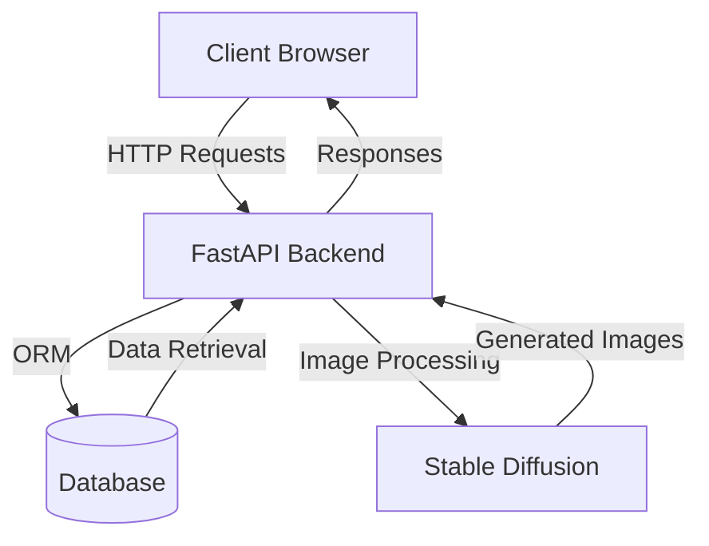

# Stunning Modeling Studio - Architecture

## System Overview

The Stunning Modeling Studio is a local-first AI modeling system designed to create and manage AI-generated models with layered styling capabilities. The system allows users to create base models for clients, apply various styling layers (hair, outfit, scene), and maintain a history of generated images in lookbooks.

## Tech Stack

### Backend
- **FastAPI**: High-performance Python web framework for building APIs
- **SQLAlchemy**: SQL toolkit and Object-Relational Mapping (ORM) for Python
- **Pydantic**: Data validation and settings management using Python type annotations
- **Stable Diffusion**: AI model integration for image generation and manipulation
- **JWT**: JSON Web Tokens for authentication and authorization
- **SQLite/PostgreSQL**: Database for storing client data, models, and history

### Frontend
- **Next.js**: React framework for building user interfaces
- **Tailwind CSS**: Utility-first CSS framework for styling
- **React Query**: Data fetching and state management
- **React Hook Form**: Form validation and handling
- **Axios**: HTTP client for API requests

### DevOps
- **Docker**: Containerization for consistent development and deployment
- **Docker Compose**: Multi-container Docker applications
- **GitHub Actions**: CI/CD pipeline for testing and deployment

## Data Flow

1. **Client Creation**:
   - User creates a new client profile with basic information
   - System stores client data in the database

2. **Base Model Creation**:
   - User uploads reference images for a client
   - System processes images and creates a base embedding using Stable Diffusion
   - Base embedding is stored and associated with the client

3. **Styling Application**:
   - User selects a client and their base model
   - User applies styling layers (hair, outfit, scene) from templates or custom inputs
   - System combines base model with styling layers to generate preview

4. **Prompt-Based Editing**:
   - User provides text prompts to refine the generated image
   - System applies prompt-based edits using Stable Diffusion
   - User can also use inpainting for targeted modifications

5. **History and Lookbook**:
   - Each generated image is saved to history with associated metadata
   - User can browse history in the lookbook
   - User can restore previous versions or export images

## Component Interaction

## Security Architecture

- **Authentication**: JWT-based authentication system
- **Authorization**: Role-based access control (RBAC)
- **Data Protection**: Secure local storage of model assets
- **API Security**: CORS/CSRF protections
- **Input Validation**: Request validation using Pydantic schemas

## Extensibility

The system is designed to be extensible in several ways:

1. **New Styling Templates**: Additional hair, outfit, and scene templates can be added
2. **Alternative AI Models**: The abstraction layer allows for integration of different AI models
3. **Custom Workflows**: The modular architecture supports custom workflows for specific client needs
4. **Theming**: Per-client theming support for customized UI experiences

## Performance Considerations

- Local-first approach minimizes latency for image generation
- Caching strategies for frequently accessed data
- Optimized image processing pipeline
- Efficient database queries using SQLAlchemy
